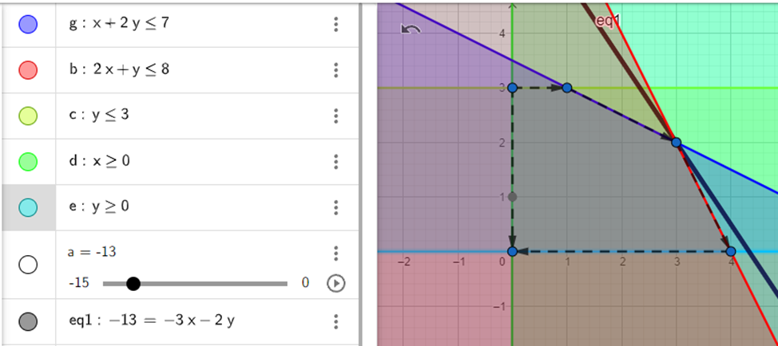
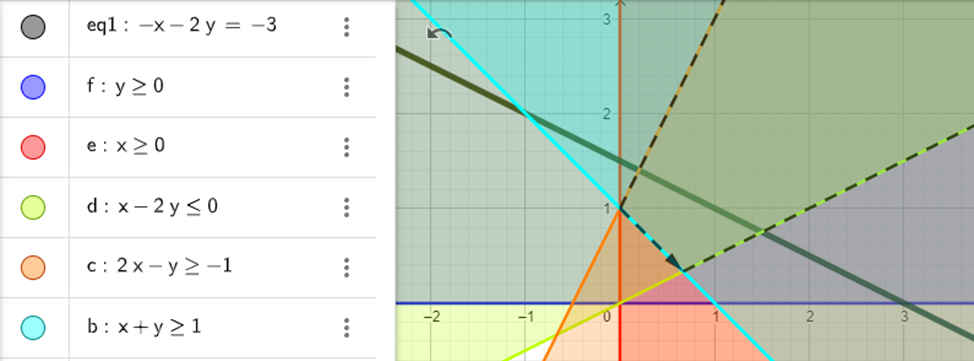
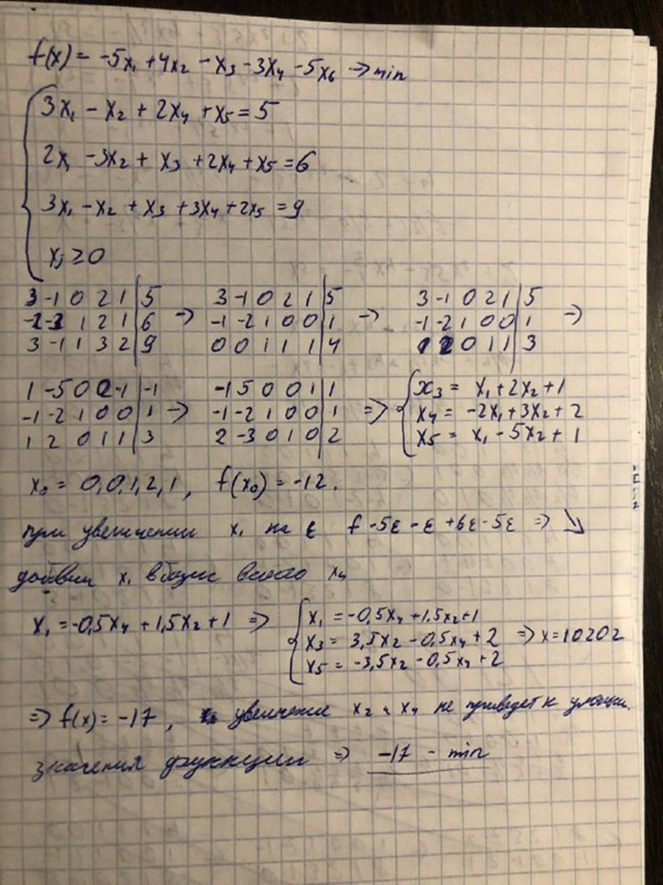
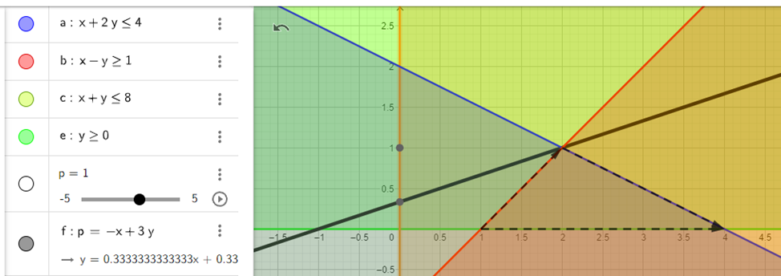

# Задание 6

Графический метод решения задачи ЛП основан на геометрической интерпретации задачи ЛП и применяется в основном при решении задач двумерного пространства и только некоторых задач трёхмерного пространства. Задачу пространства размерности больше трёх изобразить графически вообще невозможно. 

a. Строятся прямые ограничений.

b. Определяется многоугольник решений системы ограничений.

c. Строится вектор, определяющий направление целевой функции.

d. Изначально берется функция c1x1 + c2x2 = 0 и перемещается в направлении вектора до крайней точки многоугольника решений.

e. Вычисляются координаты точки и значение функции.

Решением может быть одна точка, в которой достигается минимум (максимум), любая точка определенного отрезка или функция, может быть, не ограничена сверху или снизу.

# Задание 7

Min = -13 при x1 = 3, x2 = 2.

# Задание 8

Невозможно найти минимум

# Задание 9

# Задание 10

Max = 1 при x1 = 2, x2 = 1.

